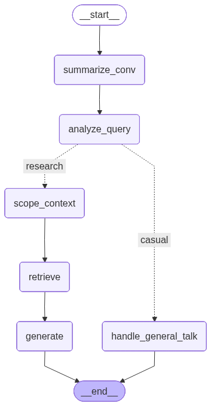

# 📚 ArxivHub

## Overview

ArxivHub is a research assistant platform that enables users to ingest, browse, take notes and interact with their personal collection of academic papers.

In a research context, answers must be both **precise and grounded in source material**. Users may ask anything from highly specific questions about a specific paper to broader requests such as comparing methods, assumptions or results across multiple works. ArxivHub is designed to support this full spectrum of research queries.

ArxivHub is a **technical demo of robust, interpretable, and extensible RAG workflows**, designed with multi-user support in mind. It implements an **advanced, multi-stage RAG pipeline** aimed at producing **reliable responses**. The system dynamically analyzes user queries, scopes relevant papers, adapts its retrieval strategy, and audits the retrieved knowledge before generating a final answer.

  
  

## Key Features ✨

### 📚 Research Workspace
- Ingest a personal collection of academic papers.
- Browse and manage a paper inventory with associated metadata.
- Take and store notes per paper for long-term research tracking.

### 💬 Conversational Research Assistant
- Ask natural language questions about a single paper or across multiple papers.
- Explore, compare, and reason over research content through dialogue.
- Maintain conversation history to support follow-up questions.

### 🧠 Intelligent Query Handling
- Automatically detects user intent (casual vs research-oriented).
- Requests clarification for ambiguous or underspecified questions.
- Rewrites queries into self-contained forms for improved retrieval.

### 🎯 Metadata-Aware Context Scoping
- Uses paper-level metadata (titles, topics, authors, publication years) to identify relevant subsets of the user’s library before retrieval.
- Prioritizes papers that are most likely to contribute meaningful context.

### 🔄 Adaptive Retrieval Strategies
- Dynamically selects between different retrieval modes depending on query scope and available context.
- Ensures both relevance and representativity across multiple papers.

### 🛡️ Knowledge Validation and Auditing
- Grades retrieved documents for relevance to the question.
- Detects incomplete or insufficient context.
- Triggers additional retrieval via targeted web search (Tavily) when important aspects of the question remain unanswered.

### ⚙️ Multi-User and Asynchronous Architecture
- Supports multiple users with isolated knowledge bases.
- Asynchronous ingestion and querying for responsive interactions.
- Designed as an extensible system.

## RAG Workflow 🔍

ArxivHub implements a **multi-stage Retrieval-Augmented Generation (RAG) workflow** designed to provide precise, grounded, and context-aware answers to research queries. The workflow is structured as a series of nodes, each responsible for a specific task.

### 1️⃣ Conversation Summarization
- Incoming user queries are first paired with the conversation history.
- Summarizes the dialogue to maintain context for follow-up questions and reasoning.

### 2️⃣ Query Analysis
- Extracts the **intent** of the user query (casual conversation vs research-focused).  
- Detects ambiguous or incomplete queries and requests clarification if needed.  
- Identifies metadata hints (titles, authors, publication years, topics) for context scoping.  
- Rewrites queries into a **self-contained form** to ensure clarity for downstream nodes.

### 3️⃣ Context Scoping
- Evaluates the user's paper inventory to determine which papers are most relevant based on the query's metadata hints.  
- Uses **fuzzy matching** to score papers according to title, topic, authorship, and publication year relevance.  
- Returns a subset of promising papers for focused retrieval.

### 4️⃣ Retrieval
- **Adaptive retrieval** based on the scoped papers:
  - **Scoped retrieval**: fetches chunks from the most relevant papers while ensuring representation across multiple sources (with Qdrant groups).  
  - **Fallback similarity search**: if context scoping retrieval yields no confident results, a standard vector similarity search retrieves relevant chunks from the entire user library.  
- Ensures retrieved documents meet a **relevance score threshold** for quality.

### 5️⃣ Document Grading
- Assesses the relevance of retrieved chunks with an LLM:
  - Fully answers the query  
  - Partially answers  
  - Irrelevant  
- High-confidence chunks are passed directly to the next stage to **reduce latency**.

### 6️⃣ Knowledge Auditing
- Combines retrieved chunks and checks for completeness against the query.  
- Detects missing aspects of the question not covered by current knowledge.  
- If gaps exist, triggers **targeted web search (Tavily)** to retrieve external information.

### 7️⃣ Response Generation
- Uses a larger, research-focused LLM to synthesize the final answer.  
- Integrates retrieved knowledge, audit feedback, and conversation history to produce **precise, grounded, and context-aware responses**.  
- Casual queries are handled by a smaller LLM for conversational replies.

---

### Workflow Highlights
- **Adaptive**: Retrieval strategy changes depending on query scope and context.  
- **Corrective**: Ensures completeness and relevance before answering.  
- **User-aware**: Multi-user architecture maintains isolated knowledge bases.  
- **Extensible**: Graph design allows components to be added/deleted easily.

## Tech Stack 🛠️

- **Python 3.11+** – Programming language   
- **LangChain & LangGraph** – orchestrate the RAG workflow 
- **Qdrant** – vector database and search engine.
- **Gradio** – Creating the user interface for the demo.

